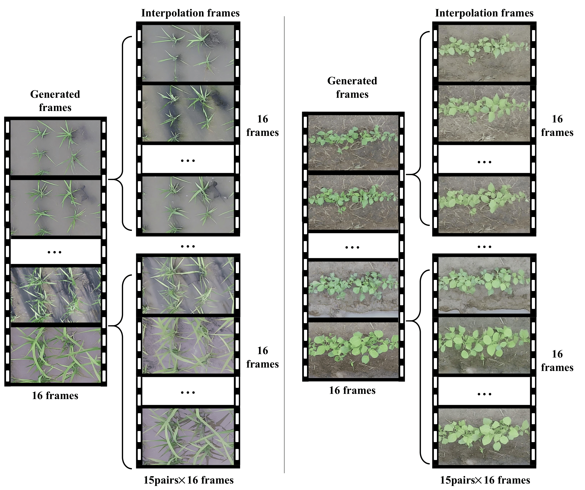

# Agricrafter

🚧 **The project is under code cleanup and organization. Stay tuned!**

**Agricrafter** is a full-growth-cycle crop video generation model. It leverages video diffusion models to realistically simulate crop growth over time.

The repository is currently being prepared for public release. Core components, models, and detailed documentation will be available soon.

## 🧬 1. Crop Growth Dataset Construction

We build a crop growth video dataset capturing full life cycles.

  
  
<em>Figure: Example frame from our constructed crop growth dataset.</em>

---

## 🆚 2. Comparison with Baseline Methods

We compare Agricrafter with 5 baseline methods on realistic crop growth generation. Each column shows the same input scenario; the first row is the output from baseline methods, and the second row is from our Agricrafter.

<h4 align="center">🔁 Row 1: Baseline Outputs   |   Row 2: Agricrafter (Ours)</h4>

<table>
  <tr>
    <td align="center">
      <video src="https://github.com/user-attachments/assets/7805ae96-96b5-4494-b273-99ce5b201220" controls width="80">
      </video>
    </td>
    <td align="center">
      <video src="https://github.com/user-attachments/assets/08226e9f-f2cb-41a6-983b-59669f25d506" controls width="80">
      </video>
    </td>
    <td align="center">
      <video src="https://github.com/user-attachments/assets/16920227-bf18-4ce0-8d59-55f0f2dc9c41" controls width="80">
      </video>
    </td>
    <td align="center">
      <video src="https://github.com/user-attachments/assets/ce779574-a551-4bb8-8b65-2665baa7a268" controls width="80">
      </video>
    </td>
    <td align="center">
      <video width="200" controls>
        <source src="https://github.com/user-attachments/assets/123ff3ba-86a2-4083-bea3-c2bb9248e886" type="video/mp4">
      </video>
    </td>
  </tr>
  <tr>
    <td align="center">
      <video src="assets/demo_video/0001.mp4" controls width="100">
      </video>
    </td>
    <td align="center">
      <video width="200" controls>
        <source src="assets/demo_video/0002.mp4" type="video/mp4">
      </video>
    </td>
    <td align="center">
      <video width="200" controls>
        <source src="assets/demo_video/0003.mp4" type="video/mp4">
      </video>
    </td>
    <td align="center">
      <video width="200" controls>
        <source src="assets/demo_video/0003.mp4" type="video/mp4">
      </video>
    </td>
    <td align="center">
      <video width="200" controls>
        <source src="assets/demo_video/0005.mp4" type="video/mp4">
      </video>
    </td>
  </tr>
</table>

---

## 🔁 3. Long-Term Generation via Frame Interpolation

Agricrafter supports **long-range video synthesis** by interpolating intermediate states from short growth clips.

### 🧠 Model Principle

  
  
<em>Figure: Interpolation-based long video generation.</em>

### 🎞️ Video Comparison: Short Video vs. Interpolated Long Sequence

<table>
  <tr>
    <th style="text-align:center">Short Video Input</th>
    <th style="text-align:center">Long Video Output (Interpolated)</th>
  </tr>
  <tr>
    <td align="center">
      <video width="300" controls>
        <source src="assets/demo_video/0002_sample0.mp4" type="video/mp4">
      </video>
    </td>
    <td align="center">
      <video width="300" controls>
        <source src="assets/demo_video/0002_sample0_merged.mp4" type="video/mp4">
      </video>
    </td>
  </tr>
  <tr>
    <td align="center">
      <video width="300" controls>
        <source src="assets/demo_video/0004_sample0.mp4" type="video/mp4">
      </video>
    </td>
    <td align="center">
      <video width="300" controls>
        <source src="assets/demo_video/0004_sample0_merged.mp4" type="video/mp4">
      </video>
    </td>
  </tr>
  <tr>
    <td align="center">
      <video width="300" controls>
        <source src="assets/demo_video/4002_sample0.mp4" type="video/mp4">
      </video>
    </td>
    <td align="center">
      <video width="300" controls>
        <source src="assets/demo_video/4002_sample0_merged.mp4" type="video/mp4">
      </video>
    </td>
  </tr>
</table>

---

## 📌 Project Overview (Coming Soon)
- Crop growth Dataset
- Crop growth simulation from images
- Support for long-range generation
- Support for control parameters

## 📂 Crop Growth Dataset (Coming Soon)

## 🔧 Installation and Usage (Coming Soon)

## 📄 License
This project will be released under the Apache2.0 License.

---

Feel free to watch or star this repository. We will continuously update and improve the codebase and documentation!
